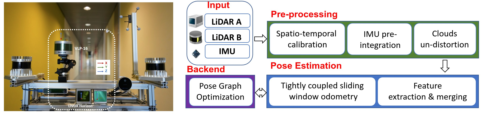
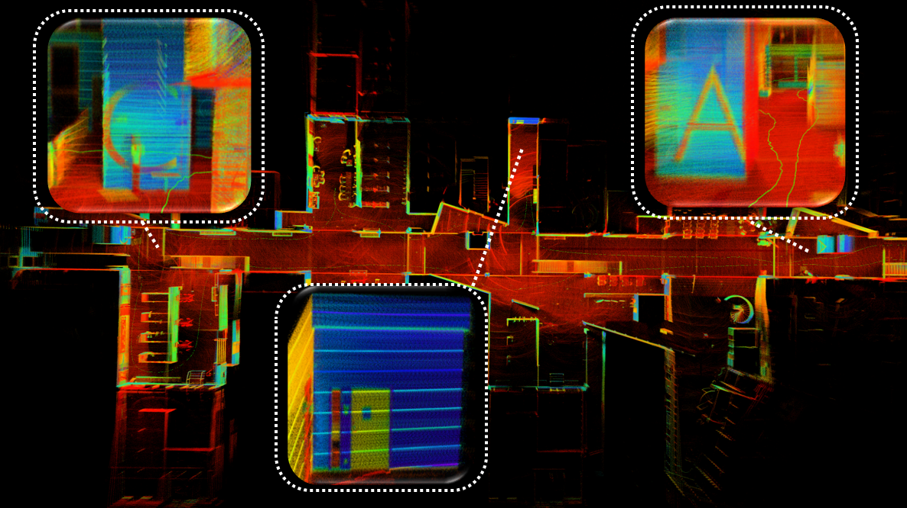
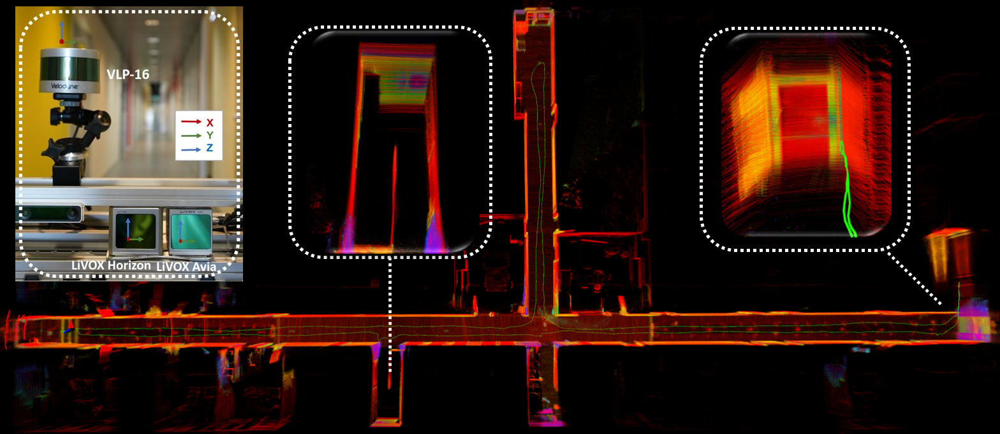
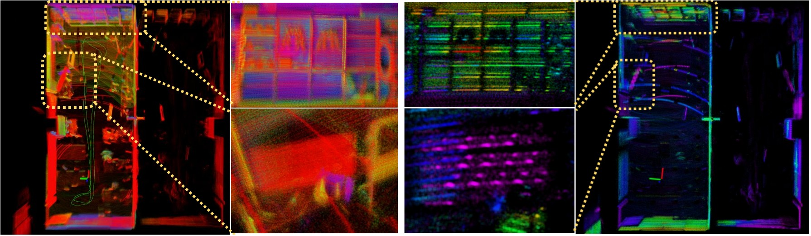
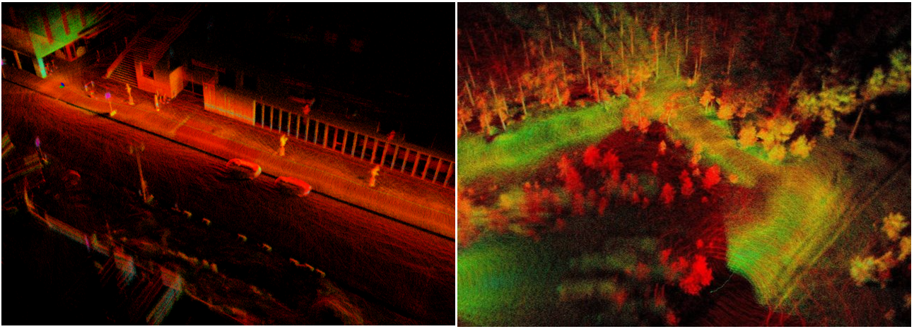

# MMLOAM : Robust Multi-Modal Multi-LiDAR-Inertial Odometry and Mapping for Indoor Environments

This is the repository for the code implementation, results, and dataset of the paper titled "Robust Multi-Modal Multi-LiDAR-Inertial Odometry and Mapping for Indoor Environments".
The current version of the paper can be accessed at [here](./doc/multi_modal_loam.pdf).

# Introduction
  <div align=left>
    
</div>
We propose a tightly-coupled multi-modal multi-LiDAR-inertial SLAM system for surveying and mapping tasks. By taking advantage of both solid-state and spinnings LiDARs, and built-in inertial measurement units (IMU). First, we use spatial-temporal calibration modules to align the timestamp and calibrate extrinsic parameters between sensors. Then, we extract two groups of feature points including edge and plane points, from LiDAR data. Next, with pre-integrated IMU data, an undistortion module is applied to the LiDAR point cloud data. Finally, the undistorted point clouds are merged into one point cloud and processed with a sliding window based optimization module.

# System Pipeline

<div align=center>

</div>
- (left )Data collecting platform. Hardware platform used for data acquisition. The sensors used in this work are the Livox Horizon LiDAR, with its built-in IMU,
and the Velodyne VLP-16 LiDAR;
(Right) The pipeline of proposed multi-modal LiDAR-inertial odometry and mapping framework. The system starts with preprocessingmodule which takes the input from sensors and performs IMU pre-integration, calibrations, and un-distortions. The scan registration module extracts features and sent the features to a tightly coupled sliding window odometry. Finally, a pose graph is built to maintain global consistency

  <div align=left>
    
    </div>
-  Mapping result with the proposed system at a hall environment.
Thanks to the high resolution of solid-state LiDAR with a non-repetitive
scan pattern, the mapping result is able to show clear detail of object’s
surface.

# Updates
-  2023.09.30 : Add docker support
-  2023.04.30 : Upload multi-modal lidar-inertial odom
-  2023.03.02 : Init repo
 

# RUN with rosbags:

## Build MM-LOAM Docker image
  ```
  - cd ~/catkin_ws/src
  - git clone https://github.com/TIERS/multi-modal-loam.git 
  - cd multi-modal-loam
  - docker build --progress=plain . -t mm-loam 
  - git submodule update --init --recursive
  ```
  **Note:** We recommend using a Docker container to run this code because there are unresolved dependencies in some Ubuntu system. Docker containers provide a consistent and isolated environment, ensuring that the code runs smoothly across different systems.


## Play rosbag
```
roscore
rosbag play office_2022-04-21-19-14-23.bag --clock
```

## Run launch file in Docker container
```
docker run --rm -it --network=host mm-loam /bin/bash -c "roslaunch mm_loam mm_lio_full.launch"
```

## Visualzation
```
rviz -d mm-loam/config/backlio_viz.rviz
```

# Loop Closure
TODO

# Dataset
Indoor environments:
1. Hall     (2.73 GB) [link](https://utufi.sharepoint.com/:u:/s/msteams_0ed7e9/ER--BA6kYdhEn549mN1sNi8B8vhNpmnYVJ4OdYsspo41KA?e=ZDFUdD)
2. Corridor (1.82 GB) [link](https://utufi.sharepoint.com/:u:/s/msteams_0ed7e9/EQnXIJU7xG1MlkdyNcJMr7MBhIIJelOh9--vk3UWhwgMiw?e=oIsLLB)
3. Office   (0.89 GB) [link](https://utufi.sharepoint.com/:u:/s/msteams_0ed7e9/Ed5phhWjm3hPmHbeucXhV4wBpwzOVjmhgLcRaDuAXDdaxQ?e=Z3FMJ8)

Outdoor enviornments:
1. Street (27.7 GB) Uploading
2. Forest (44 GB) Uploading

More datasets can be found in our previous work:
1. [tiers-lidars-dataset](https://github.com/TIERS/tiers-lidars-dataset)
2. [tiers-lidars-dataset-enhanced](tiers-lidars-dataset-enhanced)

# More results
1.  Hardware and Mapping result in long corridor environment. Our proposed methods show robust performance in long corridor environments and survive in narrow spaces where 180°U-turn occur.
    <div align=left>
    
    </div>
2. Qualitative comparison of map details in the office room dataset sequence. The color of the points represents the reflectivity provided by raw sensor data. The point size is 0.01, and transparency is set to 0.05. The middle two columns show the zoom-in view of the wall (top) and TV (bottom).
    <div align=center>
    
    </div>
3. Mapping results with the proposed method outdoors: urban street (left) and forest environment (right)..
    <div align=center>
    
    </div>


# Acknowledgements
This repo has borrowed code from the following great repositories and has included relevant copyrights in the code to give proper credit. We are grateful for the excellent work done by the creators of the original repositories, which has made this work possible. We encourage the user to read material from those original repositories.
- [LIO-LIVOX](https://github.com/Livox-SDK/LIO-Livox) : A Robust LiDAR-Inertial Odometry for Livox LiDAR
- [LEGO-LOAM](https://github.com/RobustFieldAutonomyLab/LeGO-LOAM) : A lightweight and ground optimized lidar odometry and mapping
- [LIO-MAPPING](https://github.com/hyye/lio-mapping) : A Tightly Coupled 3D Lidar and Inertial Odometry and Mapping Approach